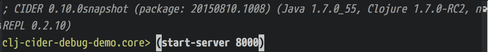

# clj-cider-debug-demo

to test cider debug

I use the latest nrepl  [org.clojure/tools.nrepl "0.2.10"] at https://github.com/clojure/tools.nrepl

- lein new luminus clj-cider-debug-demo
- clj-cider-debug-demo/src/clj_cider_debug_demo/routes/home.clj
- emacs home.clj
- cider-jack-in
- (start-server 8080)
- move cursor to `make-resp` then `cider-debug-defun-at-point`
- visit http://localhost:8080/ in browser

## Prerequisites

You will need [Leiningen][1] 2.0 or above installed.

[1]: https://github.com/technomancy/leiningen

## License

Copyright © 2015 FIXME
